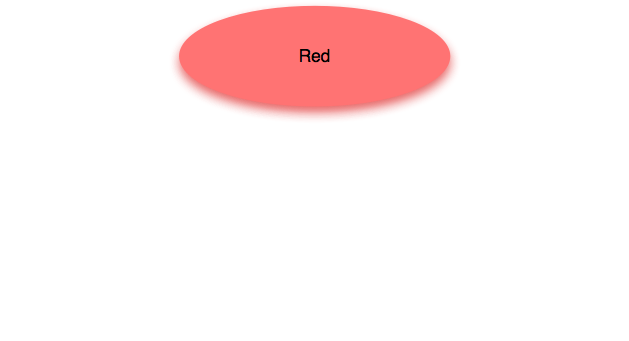
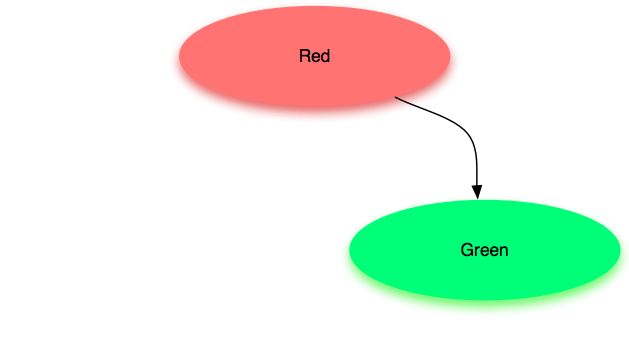
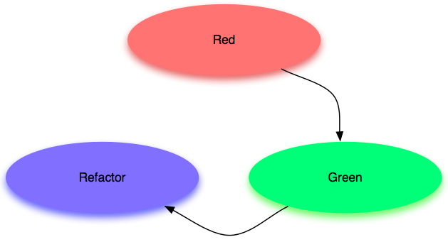
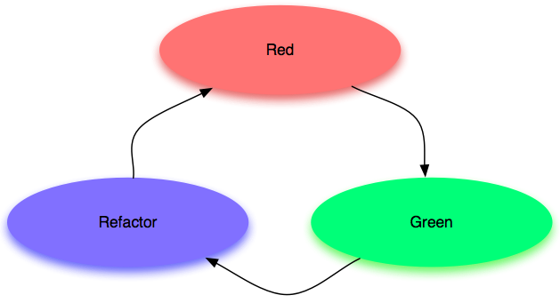

!SLIDE subsection
# Coding Dojo

!SLIDE bullets incremental
# Maitriser une compétence
* Des heures de *pratique délibérée*
* Différent de l'expérience acquise au jour le jour
* Nécessite de ralentir

!SLIDE bullets incremental
# Lieu d'entraînement
* On vient pour apprendre

!SLIDE bullets incremental
# Sûr
* On peut se tromper
* On peut ne pas savoir

!SLIDE bullets incremental
# Ouvert
* A l'extérieur
* Tous niveaux

!SLIDE bullets incremental
# Participants
* apprendre
* partager
* s'amuser

!SLIDE center
# TDD
## Test Development Driven

!SLIDE center

!SLIDE center

!SLIDE center

!SLIDE center

!SLIDE center
# Les formats du dojo

!SLIDE center
## Kata!

!SLIDE center
## Randori!

!SLIDE
# Logistique

!SLIDE
# A l'avance
## Préparation des sujets le nécéssitant
## Réservation salle + vidéo projecteur

!SLIDE
# Sur place
## Commande de sandwich
## Choix d'un sujet
## Sujet
## Feedback
